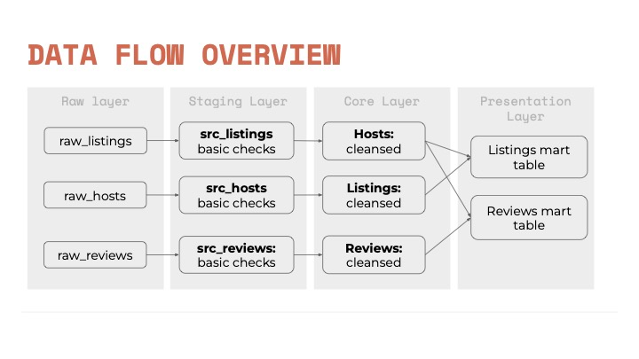

# dbt Portfolio: Airbnb Dataset Analysis with Snowflake 🏠 + ❄

## Project Overview 🚀

This project demonstrates the use of **dbt (data build tool)** for transforming and modeling data using the Airbnb dataset, which contains information about hosts, reviews, and listings. The project is built on **Snowflake**, utilizing **SQL** to create and manage data models.

## Dataset ℹ️

The Airbnb dataset consists of three main tables 📑:
- **Listings**: Information about properties available on Airbnb.
- **Hosts**: Details about the hosts offering properties.
- **Reviews**: Customer feedback on the listed properties.


## Architecture 🏙

The data pipeline is structured in the following way:
1. **Source Tables**: Raw data ingestion into Snowflake from the Airbnb dataset.
2. **Staging Tables**: Cleaned and transformed data using dbt's staging models.
3. **Final Models**:
   - **Views**: Derived data tables for analytical purposes.
   - **Ephemeral Models**: Temporary transformations that do not persist in the database.
   - **Tables**: Finalized materialized tables that persist in the Snowflake database.



## Key Features 🔑

- **dbt Configurations**: Applied various dbt configurations (e.g., materialization strategies like `view`, `table`, and `ephemeral`) to optimize data processing.
- **Data Models**: Created and documented models for easy reuse.
- **Snowflake as Data Warehouse**: Integrated dbt with Snowflake for data transformation and storage.

## Project Structure

```bash
dbt_portfolio/
├── models/
│   ├── src/
│   ├── staging/
│   ├── marts/
├── seeds/
├── snapshots/
├── logs/
├── dbt_project.yml
├── README.md
└── .gitignore


- models/src/: Contains raw source models.
- models/staging/: Contains transformed staging models.
- models/marts/: Final business logic models.

# How to Use

## Prerequisites

- Snowflake Account: Make sure you have access to a Snowflake account.
- dbt Installed: Install dbt using:

```bash
pip install dbt

```

## Setup

```bash
git clone https://github.com/Mehranmzn/dbt_portfolio.git
```

## Model Overview

- Source Tables: Extract raw data and prepare it for further processing.
- Staging Models: Clean and enrich raw data into a standardized format.
- Final Models: These models are used for analytics, reporting, or machine learning.

Example Models
- stg_listings.sql: Cleans and normalizes the listings data.
- final_hosts.sql: Aggregates host data for analytics.
- ephemeral_reviews.sql: A temporary transformation of reviews.

## Contributions

Feel free to fork this repository and create a pull request to add or improve models.

